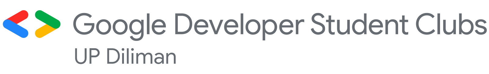
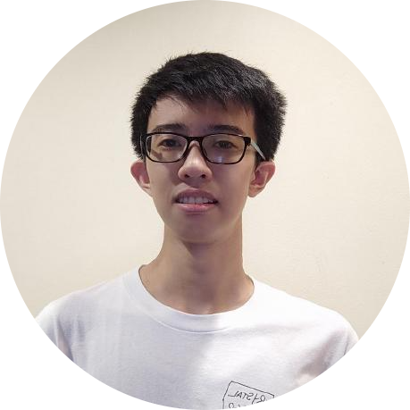
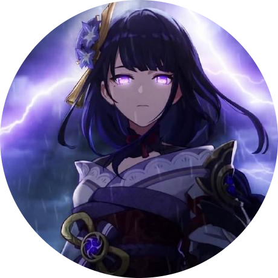
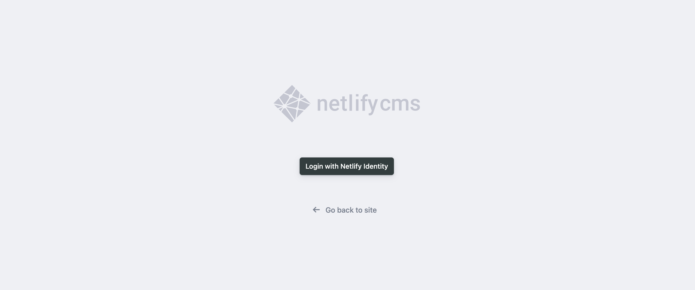

<div align="center">

  
  <h1>Google Developer Student Clubs - UP Diliman website</h1>

<a href="">[](https://app.netlify.com/sites/dscupd/deploys)</a>

Link | <a href="gdscupd.com">gdscupd.com</a>

</div>

<br />

<div align="center">
  <h2>Project Members</h2>
</div>

<br />

<div align="center">

| <br />  <p><b>Daryll Ko</b></p> | <br/>  <p><b>Edrick Gador</b></p> | <br/>  <p><b>Marc Viernes</b></p> |
| :-------------------------------------------------------------------------------------------------: | :---------------------------------------------------------------------------------------------------: | :-----------------------------------------------------------------------------------------------: |
|                                          _Lead Developer_                                           |                                              _Developer_                                              |                                            _Developer_                                            |

</div>

<br />

Welcome to the codebase for the GDSC-UPD website! This README file contains notes for data contributors and site developers in the sections to follow.

<br />

## For data contributors

To add an event, project, or a member, go to [the site's `admin` page](https://gdscupd.com/admin):

<br />

<div align="center">
  
</div>

<br />

If you don't have access to the content management system (CMS) yet, ask for an invite from one of the developers on Discord.

Adding data is as simple as choosing a `Collection`, clicking the `New [Event/Project/Member]` button, filling up the necessary information, and clicking the `Publish` button.

If you have any specific questions about the CMS, hit up Daryll on Discord!

<br />

## For developers

If you don't have access to the [Netlify dashboard](https://app.netlify.com/sites/dscupd) yet, ask for an invite from one of the developers on Discord.

Clone the repository to your local machine like so:

```bash
git clone git@github.com:DSC-Diliman/dsc-website.git
```

Once a clone has been made, install packages using npm like so:

```bash
npm i
```

To generate the site's code, run `npm run build`. Afterwards, run `npm run dev` or `npm start` to see the site in development or production mode, respectively.

Contributions are carried out in 3 main steps:

1. Create a new branch via `git checkout -b [branch name]`.
2. Once you finish your work on the branch, create a pull request via the GitHub web interface. A deploy preview will pop up in the Netlify dashboard.
3. If the deploy preview works as intended, ask one of the developers for a code review. Once your changes are approved, they can be merged into the `master` branch.

<div align="center">

### Tech stack

| Technology                                                                                                                | Purpose              | Notes                                                                                                                                             |
| ------------------------------------------------------------------------------------------------------------------------- | -------------------- | ------------------------------------------------------------------------------------------------------------------------------------------------- |
|          | React framework      | v13, [Documentation](https://nextjs.org/docs), [Tutorial](https://nextjs.org/learn)                                                               |
|                | JavaScript framework | v18, [Documentation](https://reactjs.org/docs/getting-started.html), [React Icons](https://react-icons.github.io/react-icons)                     |
|      | Type safety          | v4, [Documentation](https://www.typescriptlang.org/docs)                                                                                          |
|  | Styling              | v3, [Documentation](https://tailwindcss.com/docs)                                                                                                 |
|      | End-to-end testing   | v1, [Documentation](https://playwright.dev/docs/intro)                                                                                            |
|                | Wireframe            | [Wireframe](https://www.figma.com/file/VLKIQqE9Vb1W9A3t3NWgAb/DSC-Website-UI-Final-Submission?node-id=0%3A1)                                      |
|             | Animation            | [Documentation](https://greensock.com/docs), [Getting started](https://greensock.com/get-started), [Cheatsheet](https://greensock.com/cheatsheet) |

</div>
